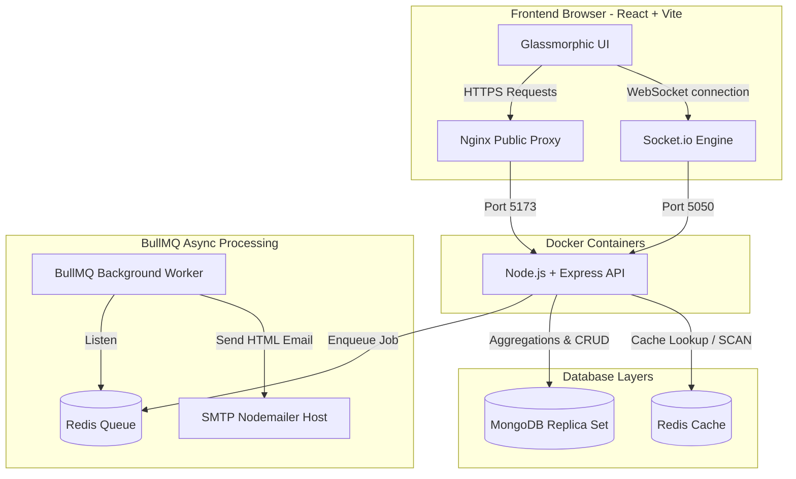
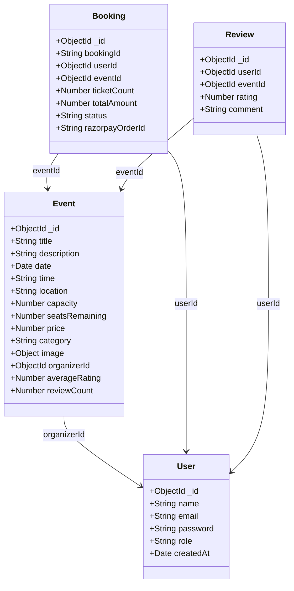

# 🎪 Evently — Premium Real-Time Event Booking Platform

An enterprise-grade, high-performance **MERN Stack** booking application. Evently delivers frictionless seat reservations, sandboxed payment gateways, async email ticket dispatch workers, real-time dashboards, and post-event rating feeds under high-availability parameters.

---

## 🚀 Key Architectural Features

*   **⚡ Sub-5ms Read Speeds (Redis)**: Implements aggressive read-heavy caching on public explore filters and search parameters. Utilizes SCAN streams for instant invalidations upon host updates or review submissions.
*   **🔌 Real-Time Seat Synchronization (Socket.io)**: Establishes low-latency WebSocket rooms for events. When an attendee books seats, all other browsers see seat availability decrement in real-time.
*   **🛠️ ACID Transactions (Mongoose)**: Employs MongoDB transactions to process concurrent checkouts, guaranteeing zero over-booking anomalies on high-demand event rooms.
*   **💳 Frictionless Payments (Razorpay Sandbox)**: Fully integrated payment gateway supporting signature checks, status verifies, and automated server-to-server webhook callback fallbacks.
*   **📧 Background Job Queue (BullMQ + Redis)**: Offloads heavy HTML ticket compile and Nodemailer SMTP operations onto background worker threads, maintaining instant HTTP response times (<200ms).
*   **🎭 Role-Based Dashboard Panels**:
    *   *Organizer Dashboard*: Receives instant Socket alert toasts on ticket purchases, provides interactive attendee registers with monospace booking IDs, rosters search, and export capabilities.
    *   *Attendee Dashboard*: Splits upcoming bookings (protected by a 24-hour cancellation lock) and past bookings. Allows profile security details updates.
*   **⭐️ Concluded Event reviews**: Implements a compound index post-event review feed. Only verified attendees can rate and review events once concluded.

---

## 🧩 Shared Service Mesh Architecture



---

## 📁 Database Schema Specifications



---

## 📡 REST API Reference

All requests must contain application/json headers. Authenticated endpoints require a `Bearer <JWT_ACCESS_TOKEN>` Authorization header.

### 🔐 Authentication Gateway
| Method | Endpoint | Auth | Description | Status Codes |
|---|---|---|---|---|
| `POST` | `/api/auth/register` | Public | Register a new user (Attendee / Organizer) | `201` Created, `400` Bad Request |
| `POST` | `/api/auth/login` | Public | Login credentials, returns access token + cookie | `200` OK, `401` Unauthorized |
| `POST` | `/api/auth/refresh` | Public | Rotates cookies, returns new JWT Access Token | `200` OK, `401` Expired Session |
| `PUT` | `/api/auth/profile` | Private | Update user name, email, or passwords | `200` OK, `401` Wrong Credentials |
| `POST` | `/api/auth/logout` | Private | Clears cookies and session caches | `200` OK |

### 🎪 Event Management & Discovery
| Method | Endpoint | Auth | Description | Status Codes |
|---|---|---|---|---|
| `GET` | `/api/events` | Public | Query search, paginated filters, Redis cached | `200` OK, `500` DB Error |
| `GET` | `/api/events/:id` | Public | Fetch event details with average stars, cached | `200` OK, `404` Not Found |
| `POST` | `/api/events` | Organizer | Hosts a new event (Multer to Cloudinary CDN) | `201` Created, `400` Form Error |
| `PUT` | `/api/events/:id` | Organizer | Edit hosted event, flushes Redis listing caches | `200` OK, `403` Forbidden |
| `DELETE` | `/api/events/:id` | Organizer | Cascade deletes event & refunds bookings | `200` OK, `403` Forbidden |
| `GET` | `/api/events/host/my-events` | Organizer | Retrieves all events hosted by current organizer | `200` OK |

### 🎫 Booking & Payment gateways
| Method | Endpoint | Auth | Description | Status Codes |
|---|---|---|---|---|
| `POST` | `/api/bookings` | Attendee | Initiate seat booking (ACID transaction locks) | `201` Created, `400` Overbooked |
| `GET` | `/api/bookings/my-bookings` | Attendee | Fetch user bookings history (Upcoming vs Past) | `200` OK |
| `PUT` | `/api/bookings/:id/cancel` | Attendee | Cancel booking, release seats, check 24h shield | `200` OK, `400` Cancel Guard Lock |
| `POST` | `/api/payments/verify` | Attendee | Check signature verification for sandbox bookings | `200` OK, `400` Invalid Signature |
| `GET` | `/api/bookings/event/:eventId` | Organizer | Fetch registered attendee list rosters for event | `200` OK, `403` Forbidden |

### ⭐️ Rating & Reviews System
| Method | Endpoint | Auth | Description | Status Codes |
|---|---|---|---|---|
| `POST` | `/api/reviews` | Attendee | Publish post-concluded review, aggregation hook | `201` Created, `400` Bad Request |
| `GET` | `/api/reviews/event/:eventId` | Public | Fetch review grid and comment lists for event | `200` OK |
| `GET` | `/api/reviews/check/:eventId` | Attendee | Verify booking eligibility status to write review | `200` OK |

---

## ⚙️ Running Locally

### Option A: Complete Docker Compose Orchestration (Recommended)
Required: **Docker Desktop** installed. Spins up standard services in a secure shared mesh network.

1.  **Configure Environment**: Check root `docker-compose.yml` backend and frontend environment configs.
2.  **Spin up Container Service Mesh**:
    ```bash
    docker compose up --build
    ```
3.  **Access the Platform**:
    *   Vite Client: `http://localhost:5173`
    *   API Gateway: `http://localhost:5050`
    *   Redis Server: `localhost:6379`
    *   MongoDB Instance: `localhost:27017`

### Option B: Individual Development Servers (Traditional)
Required: **Node.js v18+**, **MongoDB Replica Set** running locally, and **Redis** server active.

#### 1. Setup Backend:
```bash
cd backend
npm install
# Create a .env file with MongoDB & Redis credentials (see .env.example)
npm run dev
```

#### 2. Setup Frontend:
```bash
cd ../frontend
npm install
# Create a .env file with VITE_API_URL=http://localhost:5050/api
npm run dev
```
Explore the app on `http://localhost:5173`!

---

## 🧪 Developer Testing & Verification Guides

*   **Real-time Alerts Check**: Open an attendee window in one tab and the Organizer Host Dashboard in an Incognito tab side-by-side. Make a booking to see immediate WebSocket notifications.
*   **SMTP Background Worker**: Watch console logs for BullMQ picking up `[send-confirmation]` mail queues and compiling dark-mode HTML tickets asynchronously.
*   **Past Event review Seed**: To easily test post-event reviews, book an event, then navigate to your `backend/` directory in the terminal and run:
    ```bash
    node backdate-events.js
    ```
    This utility immediately backdates MongoDB events to yesterday and flushes intermediate Redis cache locks so you can instantly submit star ratings!
